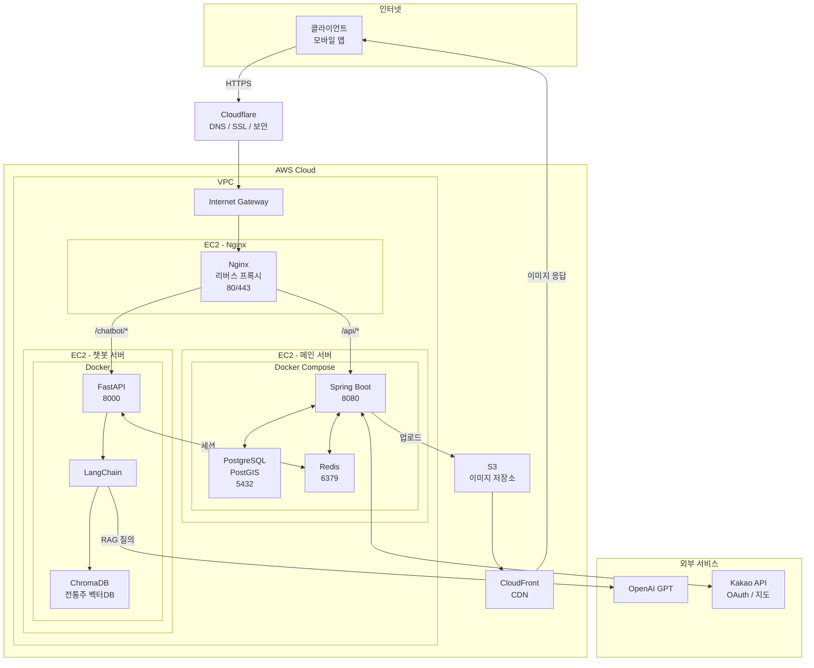

```mermaid
flowchart TB
    subgraph 인터넷
        Client["클라이언트<br/>모바일 앱"]
    end

    Cloudflare["Cloudflare<br/>DNS / SSL / 보안"]

    subgraph AWS["AWS Cloud"]
        subgraph VPC["VPC"]
            IGW["Internet Gateway"]

            subgraph Nginx서버["EC2 - Nginx"]
                Nginx["Nginx<br/>리버스 프록시<br/>80/443"]
            end

            subgraph 메인서버["EC2 - 메인 서버"]
                subgraph 도커1["Docker Compose"]
                    SpringBoot["Spring Boot<br/>8080"]
                    PostgreSQL["PostgreSQL<br/>PostGIS<br/>5432"]
                    Redis["Redis<br/>6379"]
                end
            end

            subgraph 챗봇서버["EC2 - 챗봇 서버"]
                subgraph 도커2["Docker"]
                    FastAPI["FastAPI<br/>8000"]
                    LangChain["LangChain"]
                    ChromaDB["ChromaDB<br/>전통주 벡터DB"]
                end
            end
        end

        CloudFront["CloudFront<br/>CDN"]
        S3["S3<br/>이미지 저장소"]

    end

    subgraph 외부서비스["외부 서비스"]
        OpenAI["OpenAI GPT"]
        KakaoAPI["Kakao API<br/>OAuth / 지도"]
    end

    Client -->|HTTPS| Cloudflare
    Cloudflare --> IGW
    IGW --> Nginx
    Nginx -->|" /api/* "| SpringBoot
    Nginx -->|" /chatbot/* "| FastAPI
    SpringBoot <--> PostgreSQL
    SpringBoot <--> Redis
    SpringBoot -->|업로드| S3
    S3 --> CloudFront
    CloudFront -->|이미지 응답| Client
    SpringBoot <--> KakaoAPI
    FastAPI --> LangChain
    LangChain --> ChromaDB
    LangChain -->|RAG 질의| OpenAI
    FastAPI <-->|세션| Redis
```
