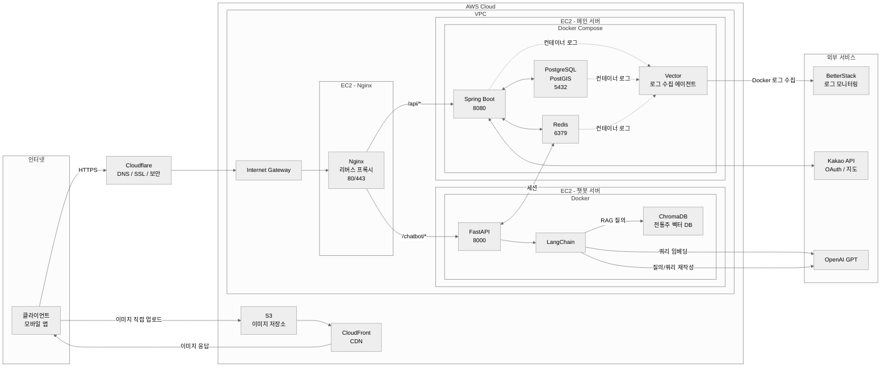

```mermaid
---
config:
  theme: neutral
---
flowchart LR
    subgraph s1["인터넷"]
        Client["클라이언트<br>모바일 앱"]
    end
    subgraph s2["EC2 - Nginx"]
        Nginx["Nginx<br>리버스 프록시<br>80/443"]
    end
    subgraph s3["Docker Compose"]
        Vector["Vector<br>로그 수집 에이전트"]
        Redis["Redis<br>6379"]
        PostgreSQL["PostgreSQL<br>PostGIS<br>5432"]
        SpringBoot["Spring Boot<br>8080"]
    end
    subgraph s4["EC2 - 메인 서버"]
        s3
    end
    subgraph s5["Docker"]
        ChromaDB["ChromaDB<br>전통주 벡터 DB"]
        LangChain["LangChain"]
        FastAPI["FastAPI<br>8000"]
    end
    subgraph s6["EC2 - 챗봇 서버"]
        s5
    end
    subgraph VPC["VPC"]
        IGW["Internet Gateway"]
        s2
        s4
        s6
    end
    subgraph AWS["AWS Cloud"]
        S3["S3<br>이미지 저장소"]
        CloudFront["CloudFront<br>CDN"]
        VPC
    end
    subgraph s7["외부 서비스"]
        BetterStack["BetterStack<br>로그 모니터링"]
        KakaoAPI["Kakao API<br>OAuth / 지도"]
        OpenAI["OpenAI GPT"]
    end
    Client -- HTTPS --> Cloudflare["Cloudflare<br>DNS / SSL / 보안"]
    Cloudflare --> IGW
    IGW --> Nginx
    Nginx -- /api/* --> SpringBoot
    Nginx -- /chatbot/* --> FastAPI
    SpringBoot <--> PostgreSQL & Redis & KakaoAPI
    Client -- 이미지 직접 업로드 --> S3
    S3 --> CloudFront
    CloudFront -- 이미지 응답 --> Client
    FastAPI --> LangChain
    LangChain -- 쿼리 임베딩 --> OpenAI
    LangChain -- RAG 질의 --> ChromaDB
    LangChain -- 질의/쿼리 재작성 --> OpenAI
    FastAPI <-- 세션 --> Redis
    Vector -- Docker 로그 수집 --> BetterStack
    SpringBoot -. 컨테이너 로그 .-> Vector
    PostgreSQL -. 컨테이너 로그 .-> Vector
    Redis -. 컨테이너 로그 .-> Vector
```
